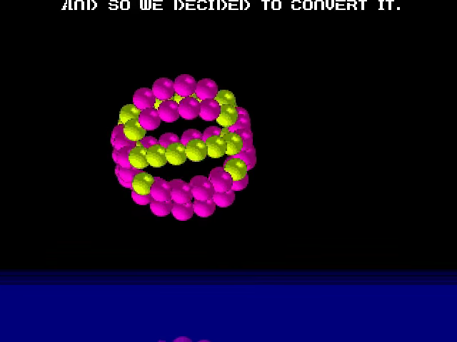
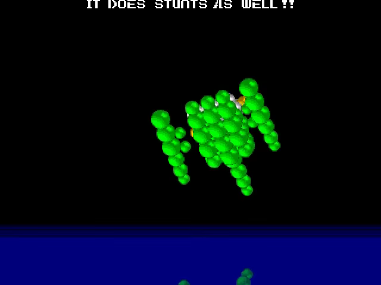
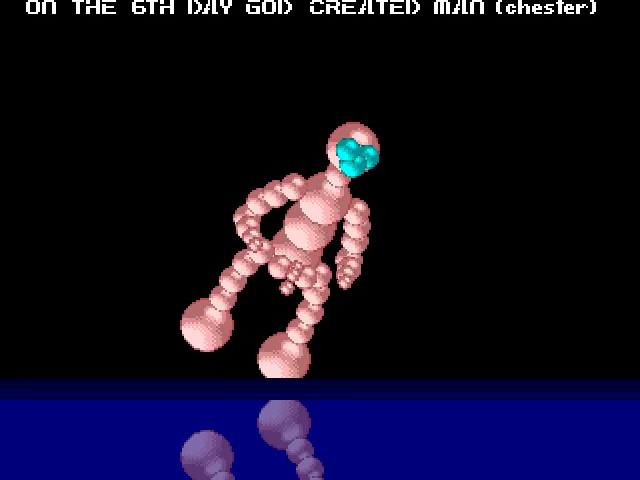
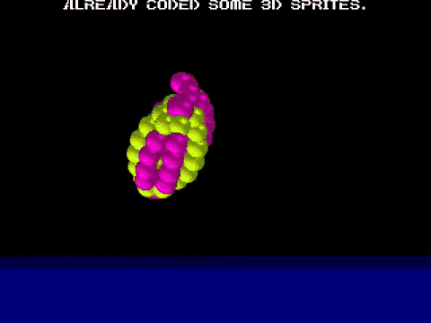

# go-vectorballs

Port Go/Ebitengine de la démo Vectorballs de Red Sector.

<!-- Project showcase -->
## Screenshots

[](docs/media/screenshot-1.png)

Vector-ball sphere and its water reflection.

[](docs/media/screenshot-2.png)

Animated vector-ball helicopter.

[](docs/media/screenshot-3.png)

Human figure built from vector balls.

## Video

[](https://github.com/olivierh59500/go-vectorballs/raw/refs/heads/main/docs/media/preview.mp4)

**[Watch or download the 24-second MP4 preview with sound](https://github.com/olivierh59500/go-vectorballs/raw/refs/heads/main/docs/media/preview.mp4)**

This short showcase combines selected passages from the Go production.

The animated image is silent; the MP4 includes the soundtrack.

<!-- End project showcase -->

## Desktop

Prérequis : Go 1.25 ou plus récent.

```sh
go run ./cmd/vectorballs
```

## Android

Prérequis :

- JDK 17 ;
- Android SDK 36 et platform-tools ;
- Android NDK 28.2.13676358 ;
- débogage USB autorisé sur le téléphone.

Pour générer l'AAR ARM64, assembler l'APK, l'installer et le lancer :

```sh
./scripts/run-android.sh
```

Pour construire et installer la version DCK avec les mêmes assets :

```sh
./scripts/run-android.sh --dck
```

L'option `--build-only` prépare l'APK choisi sans l'installer.
L'activité garde désormais l'écran allumé tant que la démo est au premier plan,
comme les autres démos Android ; le verrouillage manuel reste possible.

Avec plusieurs appareils connectés :

```sh
ANDROID_SERIAL=<serial> ./scripts/run-android.sh
```

L'APK debug est généré dans
`android/app/build/outputs/apk/debug/app-debug.apk`.

## Vérifications

```sh
go test ./...
go vet ./...
```

## Optional DCK version

The original implementation remains at its original paths. Run it with `go run ./cmd/vectorballs`.

The construction-kit version is in [dck/](dck/README.md). Run `go run ./dck/cmd/vectorballs` from this directory. Both versions share the original assets.
